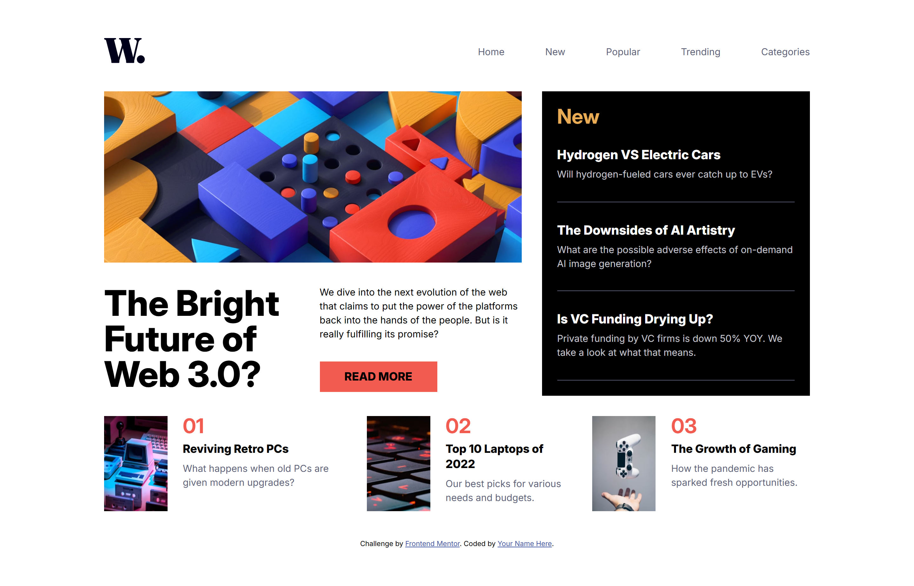
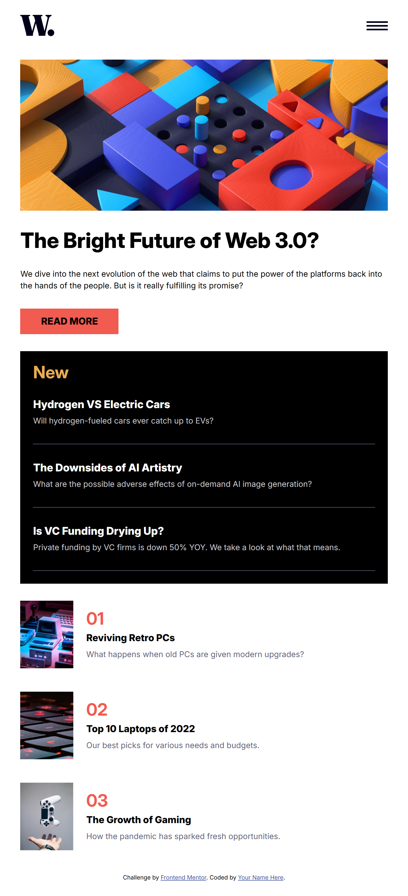
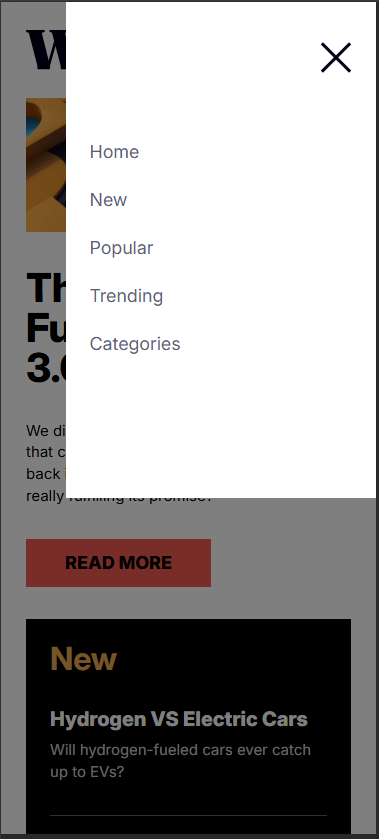

# Frontend Mentor - News homepage


## Welcome! 👋

Thanks for checking out this front-end coding challenge.

[Frontend Mentor](https://www.frontendmentor.io) challenges help you improve your coding skills by building realistic projects.

**To do this challenge, you need a good understanding of HTML and CSS, and basic JavaScript.**

## Table of contents

- [Overview](#overview)
  - [The challenge](#the-challenge)
  - [Screenshot](#screenshot)
  - [Links](#links)
- [My process](#my-process)
  - [Built with](#built-with)
  - [What I learned](#what-i-learned)
  - [Continued development](#continued-development)
  - [AI Collaboration](#ai-collaboration)
- [Author](#author)


## Overview

### The challenge

Users should be able to:

- View the optimal layout for the interface depending on their device's screen size
- See hover and focus states for all interactive elements on the page

### Screenshot
| Desktop                        | Tablet               |  Mobile|
| ------------------------------ | -------------------- | ---------------------- |
|  | |  | 

### Links

- Solution URL: [news-homepage](https://www.frontendmentor.io/solutions/news-homepage-main-FIwG5zW-hC)
- Live Site URL: [news-homepage](https://emelinur.github.io/news-homepage-main/)

## My process

### Built with
- Semantic HTML5 markup
- CSS custom properties (Variables)
- Flexbox
- CSS Grid
- Vanilla JavaScript (DOM Manipulation)

### What I learned
During this project, I experienced firsthand that making the code just "work" is not enough; it also needs to be flexible and sustainable (using fluid structures instead of fixed pixels). My key takeaways from this process include:

1. **Semantic HTML and the `<figure>` Tag:** I realized the importance of wrapping images and logos in semantic `<figure>` tags to ensure structural meaning, rather than just throwing in an `` tag.
2. **Accessibility (A11y) & `aria-label`:** I noticed that using pure visual icons for mobile menu buttons creates a blind spot for screen readers. I learned to implement `aria-label` attributes to improve the user experience for everyone.
3. **JS `classList.toggle()` and Eliminating Redundancy:** I realized that directly manipulating CSS properties like `style.display` inside JavaScript is a bad practice that creates redundant, cluttered code. I learned that JS should act purely as a state manager, and toggling classes instead of modifying inline styles dramatically elevates code quality.

Here is the JavaScript revision I am proud of:

```js
const menuToggle = () => {
  document.querySelector(".nav-menu").classList.toggle("is-active");
  document.querySelector(".menu-overlay").classList.toggle("is-active");
};

document.querySelectorAll(".open-menu, .close-menu, .menu-overlay").forEach(button => {
  button.addEventListener("click", menuToggle);
});
```
### Continued development

- In future projects, I will focus more on building fully fluid, percentage-based, and `rem`/`em` driven responsive layouts rather than using rigid `width` or `height` definitions.
- I will strictly follow the "DRY" (Don't Repeat Yourself) principle in JavaScript to avoid spaghetti code and continue to optimize my functions as much as possible.


### AI Collaboration

- **Tools Used:** Gemini AI
- **How I Used It:** After completely finishing the project using my own logic without any external help, I requested a code review to test the quality of my code and see how I could take it to the next level.
- **What Worked Well:** It helped me catch structural errors in my initial code (such as nesting media queries and direct style manipulation). It served as an excellent guide for transitioning to a cleaner, more professional architecture using `classList.toggle` and `forEach` in JavaScript.
## Author
- Frontend Mentor - [@Emelinur](https://www.frontendmentor.io/profile/Emelinur)
